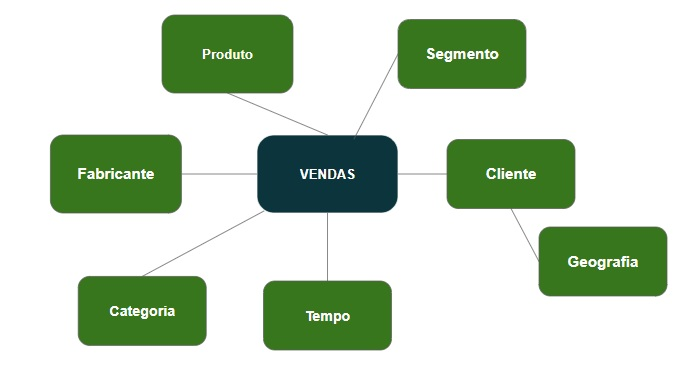

## Case_Vendas_Eng_Dados

## Apresentação do Case
Este repositório apresenta um case de engenharia de dados focado na análise detalhada de vendas dos anos de (2011/2012), desenvolvido para validar conhecimentos técnicos na área e ser submetido à banca examinadora Data Master. O projeto busca explorar o desempenho comercial a partir de múltiplas perspectivas, incluindo cliente, produto, fabricante, geografia, segmento, categoria e tempo. Além disso, são medidos KPIs essenciais, como o total de vendas e suas variações diárias, mensais e anuais, permitindo uma visão estratégica e aprofundada dos dados. Com base nessa análise, o objetivo é que a área de negócios possa identificar oportunidades e definir estratégias de crescimento fundamentadas em insights precisos, reforçando a importância da tomada de decisão orientada por dados. 

## I. Objetivo do Case

## Assunto: Análise de Vendas

### Explicado por:
- Cliente
- Produto
- Fabricante
- Geografia
- Segmento
- Categoria
- Tempo

## Objetivos da análise:
Este case visa fornecer uma visão detalhada das vendas, identificando padrões, oportunidades e insights com base nos dados analisados.

## Modelo Conceitual

Esse modelo conceitual, se caracteriza com o esquema floco de neve (snow flake), que é um modelo de dados multidimensional e uma extensão do esquema em estrela, subdividindo as tabelas de dimensão em tabelas de subdimensão. Os esquemas em floco de neve são comumente usados para business intelligence e relatórios usando análise multidimensional em data warehouses, data marts e bancos de dados relacionais.

### Métricas analisadas:
- **Total de vendas** (quantidade e valor)
- **Variações de vendas** 
  - Diária (quantidade e valor)
  - Mensal (quantidade e valor)
  - Anual (quantidade e valor)
- **Ticket médio** (quantidade e valor)
- **Total YTD/MTD** (quantidade e valor)
- **Variação do total YTD/MTD** (quantidade e valor)

## Benefícios esperados:
- Melhor compreensão do comportamento de vendas em diferentes dimensões.
- Identificação de oportunidades estratégicas com base em tendências e variações de desempenho.
- Suporte à tomada de decisão por meio de dados estruturados e visualizações analíticas.

## II. Arquitetura de Solução e Arquitetura Técnica 

## Arquitetura Medallion com PySpark, Databricks e Delta Lake

Este case foi desenvolvido utilizando **notebooks em PySpark**, com a implementação da arquitetura **Medallion** nas camadas **Bronze, Silver e Gold**, por meio do **Databricks Community e Delta Lake**. Entre as funcionalidades implementadas, destacam-se:

- Criação de **surrogate keys** (chaves substitutas) para as dimensões;
- Otimização da **tabela fato** na camada Gold.

### Estrutura dos Notebooks

Foram desenvolvidos **9 notebooks**, organizados e numerados para facilitar a compreensão da ordem de execução:

1. `000 Criando os Diretórios`  
2. `001 Importando o Arquivo`  
3. `002 Load Camada Bronze`  
4. `003 Transformações Camada Silver`  
5. `004 Load Camada Gold Delta`  
6. `005 Load Gold Delta Incremental`  
7. `006 Consultas Otimizadas`  
8. `007 Criação de tabelas Delta`  
9. `008 Rotinas de Manutenção Delta`  

Cada notebook contém **explicações e justificativas** sobre sua utilização e implementação, proporcionando uma visão clara do processo.

## 🏗️ Arquitetura Medallion

A Arquitetura Medallion é um modelo de processamento de dados em camadas que organiza os dados de maneira estruturada e otimizada para análise. Ela é composta pelas seguintes etapas:

### 🔹 Landing Zone
Os dados são armazenados de forma bruta, sem qualquer tipo de processamento. Esta camada é essencial para garantir que os dados originais estejam disponíveis para auditoria e rastreamento. Outro benefício da landing zone é a preservação dos dados brutos, permitindo que, em caso de erro no processo de ETL, seja possível reutilizá-los sem a necessidade de uma nova extração dos dados de produção. O notebook `001 Importando o Arquivo` contém as importação para a Landing Zone.

### 🥉 Bronze
A camada Bronze é responsável pela importação dos dados brutos. Nesta camada, foi realizado a importação de um arquivo .csv contendo dados fictícios de vendas referentes ao ano de 2011 e 2012 armazenado neste repositório com o nome dados_vendas_2011.csv e dados_vendas_2012.csv. Estes são os únicos arquivos a serem importados para a camada Bronze. Os detalhes e justificativas sobre a camada bronze podem ser encontrados no notebook `002 Load Camada Bronze`.

### 🥈 Silver
Na camada Silver, os dados são limpos, padronizados e transformados para facilitar a análise. O DataFrame df_bronze é ajustado para df_silver, convertendo datas, formatando valores monetários, refinando a estrutura dos campos e excluindo colunas desnecessárias. Além disso, o nome e o e-mail são mascarados para garantir a proteção dos dados. Os detalhes e justificativas sobre a camada silver podem ser encontrados no notebook `003 Transformações Camada Silver`.

### 🏆 Gold
Na camada Gold, os dados da camada Silver são lidos e transformados para a criação de Delta Parquet, estruturando as dimensões produto, categoria, segmento, fabricante, geografia, cliente e a fato vendas. Esse processo é implementado pelo notebook `004 Load Camada Gold Delta`.
Além disso, dentro da mesma camada, o notebook ´005 Load Gold Delta Incremental` é responsável pela importação de novos arquivos, incluindo a carga nas camadas Bronze e Silver, a atualização das dimensões e a criação da fato vendas.
Como estou utilizando a versão Community do Databricks, não foi possível automatizar esse fluxo via workflow, tornando necessário realizar a carga manualmente, executando os notebooks `001`, `002`, `003` e `004`. Todas as justificativas e detalhes sobre esse processo estão documentados nos notebooks citados.

## III. Explicações e Justificativas sobre o case desenvolvido.
Cada notebook contém **explicações e justificativas** sobre sua utilização e implementação, proporcionando uma visão clara do processo.

## IV. Melhorias e Considerações Finais.

### Melhorias
Ao longo do desenvolvimento deste case, percebo oportunidades para aprimoramento, incluindo a exploração de diferentes formatos de importação de bases de dados, além da integração com APIs, o que permitiria um maior dinamismo na ingestão de dados.
Outro ponto relevante seria a visualização dos dados em um dashboard no Power BI. Embora a criação de dashboards não seja uma função direta do engenheiro de dados, considero valioso compreender sua aplicação para enriquecer as análises e facilitar a interpretação dos resultados. 
Esses aprimoramentos contribuiriam para tornar o case ainda mais completo e alinhado às demandas do mercado.

### Considerações Finais
Durante o desenvolvimento deste case, tive a oportunidade de explorar conceitos novos e aprofundar meu entendimento em diversas etapas e processos da engenharia de dados. Esse processo não apenas ampliou minha visão sobre o tema, mas também me proporcionou novos aprendizados, fortalecendo meu conhecimento e aprimorando minhas habilidades. Foram meses de estudo intenso, nos quais pude perceber ainda mais a presença dos dados no dia a dia e sua relevância em diferentes áreas. Mesmo atuando como desenvolvedora low-code, o aprendizado adquirido sobre engenharia de dados e a área de dados em geral tem impactado positivamente minhas entregas como desenvolvedora de software, aprimorando minha capacidade de análise e tomada de decisão.

Este projeto representa apenas o início da minha jornada no universo dos dados, e sei que ainda há muito a ser explorado e aprendido. A experiência adquirida aqui fortaleceu minha determinação em continuar estudando e evoluindo, buscando sempre novas formas de aplicar esse conhecimento de maneira eficiente e inovadora.

